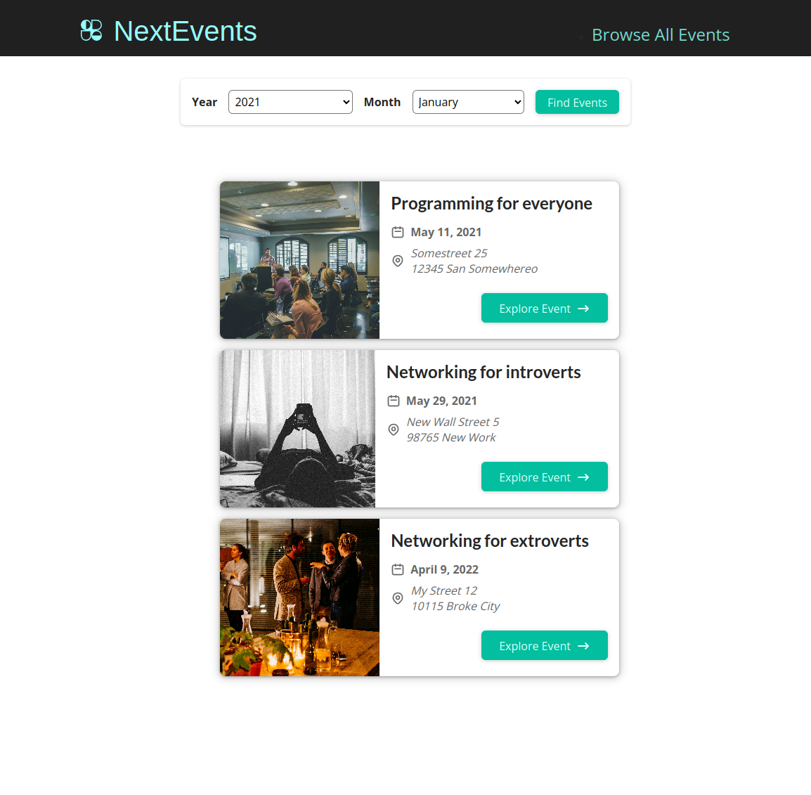

# NextEvents

This is an example project I have written using the Nextjs framework. NextEvents allows viewing and searching of local events.

# Stack

Nextjs 14, File Routing, Javascript, CSS Modules

# Usage

1. Clone the repository:

```bash
git clone git@github.com:garygause/next-events-app.git
```

or

```bash
git clone https://github.com/garygause/next-events-app.git
```

2. Install dependencies:

```bash
npm install
```

3. Run the server:

```bash
npm run dev
```

## Screenshots

Home Page  
:-------------------------:
 |

Browse Page  
:-------------------------:
 |

Details Page  
:-------------------------:
 |

## Credits

Based on the [Next.js 14 & React - The Complete Guide](https://www.udemy.com/course/nextjs-react-the-complete-guide) course by Maximilian Schwarzmüller.
